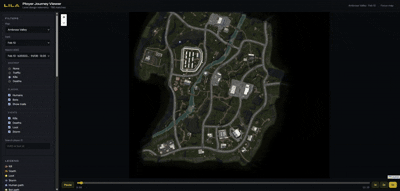

# LILA Player Journey Viewer

Interactive web tool for Level Designers to explore LILA BLACK player movement, combat, loot, and storm deaths on production minimaps.

**Live demo:**https://lila-assginment.vercel.app/



---

## Features

- Minimap rendering with correct world→pixel coordinate mapping
- Human vs bot paths (blue / green) with hover details
- Event markers: kills, deaths, loot, storm
- Filters: map, date, match, player search
- Timeline playback (play/pause, scrub, 1x/2x/5x; **Space** to toggle)
- Heatmaps: traffic, kills, deaths
- Match summary sidebar (humans, bots, duration, kills, loot, storm deaths)
- Focus map mode (**F**)

---

## Tech stack

| Layer | Choice |
| --- | --- |
| UI | React 19 + Vite + TypeScript |
| Map | Leaflet / react-leaflet |
| Heatmap | leaflet.heat |
| ETL | Python 3 + PyArrow + Pillow |
| Hosting | Static files on Vercel |

Parquet is **not** parsed in the browser. A Python script converts telemetry → optimized JSON under `public/processed/`.

---

## Repository layout

```
lila-games/
└── player-journey/      ← submission app (separate from player_data zip)
    ├── src/
    ├── public/
    │   ├── maps/
    │   └── processed/
    ├── sample/              ← 1 day only (February_14), not the full multi-day sample
    │   └── February_14/
    ├── scripts/
    │   └── convert_parquet.py
    ├── ARCHITECTURE.md
    ├── INSIGHTS.md
    └── README.md
```

---

## Prerequisites

- Node.js 20+
- Python 3.10+ (only needed to re-run the ETL)

```bash
pip install -r requirements.txt
npm install
```

---

## Data processing

The app folder is intentionally **separate** from the full multi-day `player_data` zip.

- **`sample/`** — one day only (`February_14`) for re-running the ETL in this repo (minimaps already live in `public/maps/`)
- Full 5-day extract stays outside the repo; processed JSON for all days is already in `public/processed/`

```bash
# Demo ETL on the single sample day
python scripts/convert_parquet.py ./sample

# Or point at the full unzipped player_data folder
python scripts/convert_parquet.py /path/to/player_data
```

This writes:

- `public/maps/*.jpg` — compressed 1024² minimaps
- `public/processed/index.json` — filter catalog + match summaries
- `public/processed/matches/{id}.json` — per-match paths & events
- `public/processed/insight_stats.json` — aggregates used for INSIGHTS.md

Processed JSON for this submission is already committed under `public/processed/` so reviewers can run the app without the raw Parquet zip.

---

## Run locally

```bash
npm install
npm run dev
```

Open the URL Vite prints (usually `http://localhost:5173`).

```bash
npm run build    # production build
npm run preview  # smoke-test the build
```

---

## Environment variables

None. All data is static under `public/`.

---

## Deployment (Vercel)

1. Push this repo to GitHub.
2. Import the project in Vercel (framework preset: Vite).
3. Build command: `npm run build`
4. Output directory: `dist`
5. Deploy and paste the URL at the top of this README.

No serverless functions or env vars required.

---

## Coordinate mapping (short)

```
u = (worldX - originX) / scale
v = (worldZ - originZ) / scale
pixelX = u * 1024
pixelY = (1 - v) * 1024
```

Game `y` is elevation — use `x`/`z` only. Full write-up: [ARCHITECTURE.md](./ARCHITECTURE.md).

---

## Assumptions

Documented in [ARCHITECTURE.md](./ARCHITECTURE.md). Highlights:

- Bot vs human from `user_id` shape (UUID vs numeric)
- `ts` treated as unix seconds mislabeled as timestamp[ms]
- Per-match relative timeline from `min(ts)`

---

## Insights

Three designer-facing findings with evidence: [INSIGHTS.md](./INSIGHTS.md).
